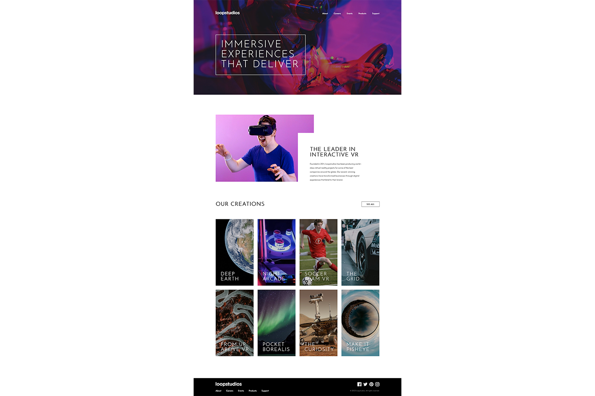
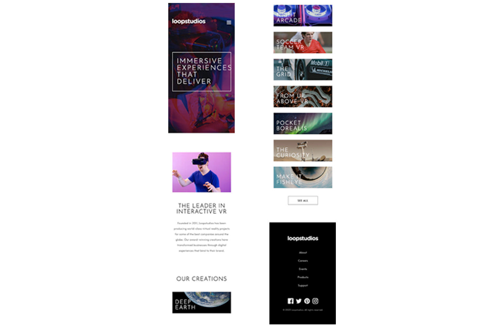

# Frontend Mentor - Loopstudios landing page solution

This is a solution to the [Loopstudios landing page challenge on Frontend Mentor](https://www.frontendmentor.io/challenges/loopstudios-landing-page-N88J5Onjw). Frontend Mentor challenges help you improve your coding skills by building realistic projects.

## Table of contents

- [The challenge](#the-challenge)
- [Screenshot](#screenshot)
- [Links](#links)
- [Built with](#built-with)
- [Author](#author)

### The challenge

Users should be able to:

- View the optimal layout for the site depending on their device's screen size
- See hover states for all interactive elements on the page

### Screenshot

DESKTOP

MOBILE

### Links

- Solution URL: [https://www.frontendmentor.io/solutions/loopstudios-landing-page-html-css-js-LvaYNJYDov](https://www.frontendmentor.io/solutions/loopstudios-landing-page-html-css-js-LvaYNJYDov)
- Live Site URL: [https://user9511.github.io/frontend-mentor-loopstudios-landing-page/](https://user9511.github.io/frontend-mentor-loopstudios-landing-page/)

## My process

### Built with

- Semantic HTML5 markup
- CSS custom properties
- Flexbox
- CSS Grid
- JavaScript

### Author

- LinkedIn - [@shanemcgeown](https://www.linkedin.com/in/shanemcgeown/)
- Frontend Mentor - [@User9511](https://www.frontendmentor.io/profile/User9511)
